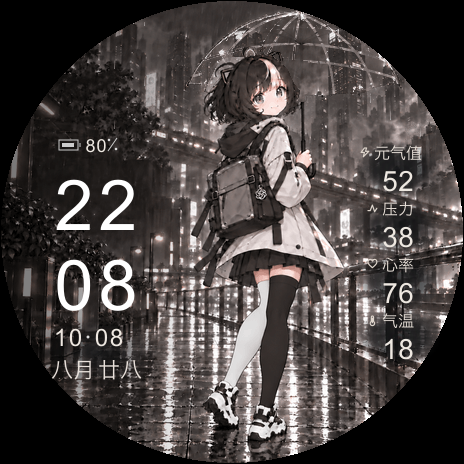
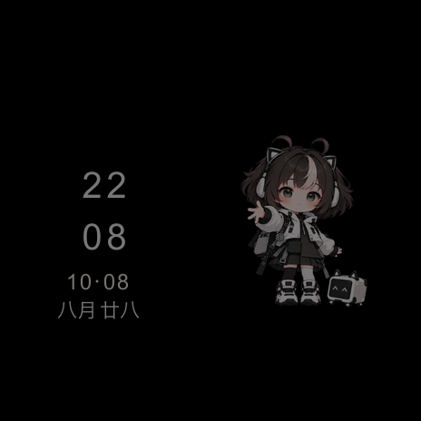

# xiaomi_watch_s5 中转

**[下载 小米手表中转.apk（0.2.0，ZIP 内保留中文文件名）](https://github.com/jsczymm1015/xiaomi_watch_s5-relay/releases/download/v0.2.0/xiaomi-watch-relay.zip)** · [直接下载 APK](https://github.com/jsczymm1015/xiaomi_watch_s5-relay/releases/download/v0.2.0/xiaomi-watch-relay.apk) · [查看所有发布文件](https://github.com/jsczymm1015/xiaomi_watch_s5-relay/releases/latest)

**[下载新版 R14 表盘 l1d-rain-r14.face](https://github.com/jsczymm1015/xiaomi_watch_s5-relay/releases/latest/download/l1d-rain-r14.face)** · [历史 R13](https://github.com/jsczymm1015/xiaomi_watch_s5-relay/releases/download/v0.2.0/l1d-rain-r13.face)

用于 **小米 Watch S5 41mm / Q63 / 464×464** 的原生 Android 表盘中转工具。通过蓝牙连接、手表认证、分块传输、安装和应用回读，把原生 `.face` 设置为当前表盘。Android 8.0 及以上；版本 0.2.0 默认内置 **L1D · 雨夜同伴 R13，ID `941006213`**，也可通过系统文件选择器导入表盘。**最新独立表盘为 R14（`941006214`）；现有 0.2.0 APK 仍内置 R13，使用 R14 必须手动选择新版 `.face`。本次不重建 APK。** 最新 `r14` Release 只更新表盘与说明，App 下载固定到历史 `v0.2.0`。仓库也提供 [faces/l1d-rain-r14.face](faces/l1d-rain-r14.face)，下载后可直接选入中转 App。

0.2.0 更新连接与传输界面，沿用已验证的协议流程和现有发布签名。新界面的最终编译、安装及真机验证状态以 [验证记录](docs/VALIDATION.md) 为准，不把旧版安装成功当作新版验证。

GitHub 附件会改写纯中文文件名，因此 ZIP 解压后是 `小米手表中转.apk`；直接下载版名为 `xiaomi-watch-relay.apk`，两者 APK 内容及签名完全一致。

## R14 预览

R14 将熄屏 Q 版人物面向观看者右侧的腿（人物左腿）改为白色过膝袜；亮屏动态与排版沿用 R13。R14 尚未真机安装。

下面两张图由 R14 原生表盘资源回读生成，**不是实拍，时间、电量、健康及天气数值均为模拟示例**。右侧四项标签与数字居中，不显示单位；元气值保持“今日新增”。

| 亮屏 | 熄屏 |
| --- | --- |
|  |  |

亮屏资源为 240 帧、17ms/帧，编码帧率约 58.82fps；包括细雨、轻微风动和楼灯呼吸。熄屏使用此前背屏素材中的 Q 版人物。编码帧率不代表手表实测帧率。

## 开始使用

1. 下载 ZIP 并解压出 `小米手表中转.apk`，或直接下载 APK，安装后，在系统提示时授予附近设备／蓝牙权限。
2. 先用小米运动健康正常绑定手表；在手机本地导出连接日志，通过本 App 的系统文件选择器导入连接信息。无需把原日志或密钥发送给他人。
3. 搜索并选择自己的手表，点击“选择表盘文件”手动导入下载的 `l1d-rain-r14.face`（不选择文件时仍使用内置 R13），点击“连接、安装并应用”。**先尝试已有绑定连接；只有连接失败且手表提示时，才进入“连接新手机”。**
4. 按手机和手表的系统提示操作，传输期间保持 App 前台。只有安装响应、应用确认和当前表盘列表回读全部通过，才显示最终成功。

已配对与搜索列表仅显示名称含 `Watch` 的设备（忽略大小写）；名称不同的设备不显示，出现在列表中并不意味着已通过 Q63 身份验证。

详细操作、导入限制和常见错误见 [使用说明](docs/USAGE.md)。扫描到蓝牙设备并不等于已获得表盘写入权限；应用层认证仍然必要。

## 适用范围

本项目仅针对 S5 **41mm / Q63**，不等同于 S5 46mm、Vela 快应用或任意蓝牙手表。不自动解绑、恢复出厂或跳过目标型号校验。**压力超过 50 自动切换伤心动态图的能力尚未证实，当前不支持；R14 仅修改熄屏袜子，没有加入压力条件动画。** [格式能力与限制](docs/FORMAT_LIMITS.md) 记录了依据。

App 不申请网络权限，不实现小米账号登录。用户选中的连接日志只在手机本地流式解析；认证信息仅用于当前运行过程，不随源码、APK说明或仓库上传。多个设备密钥、无有效字段或文件超限时会停止导入。

## 从源码构建

需要 Python 3、JDK 17+、Android SDK platform 35 和 build-tools 35.0.0。SDK 与签名私钥由构建者管理，不纳入仓库。项目入口位于仓库根目录：`AndroidManifest.xml`、`build.py`、`src/`、`res/`、`tests/`。

[下载 APK 内置的历史 R13 表盘文件](https://github.com/jsczymm1015/xiaomi_watch_s5-relay/releases/download/v0.2.0/l1d-rain-r13.face)，保存为 `faces/l1d-rain-r13.face`。R13 从历史 Release 下载；仓库 `faces/` 另提供新版 R14，现有已发布 APK 的内置表盘保持 R13。

```bash
python3 build.py --test-only
python3 build.py --sdk "$ANDROID_HOME" --face faces/l1d-rain-r13.face
```

`ANDROID_HOME` 应指向你自己的 SDK 目录，也可将其替换为明确目录。输出在 `build/`；省略 `--face` 则不内置表盘。脚本使用 javac、D8、aapt2、zipalign 和 apksigner，不通过 Gradle 下载依赖。自行构建默认使用本地开发签名，不能假设可覆盖安装官方发布 APK；更新同一安装必须使用相同签名。

R14 文件为 **26,552,338 字节**，SHA-256：

```text
4c5d57248dc5af23047591f9dbf5054b07f6c3decd99390f47e8c2a1ff531406
```

原生结构检查无 warnings，240 帧亮屏与 R13 完全一致；截图与验证边界见 [验证记录](docs/VALIDATION.md)。现有 APK 内置的历史 R13 文件为 **26,552,338 字节**，SHA-256：

```text
c54d392dd162d92cc35974f47331fb203231f855aaf4d6a74c96524b0942e5b7
```

协议与素材来源、许可证范围见 [第三方说明](docs/THIRD_PARTY.md)。项目与小米、AstroBox 无官方隶属关系；代码许可不为角色素材新增授权。
